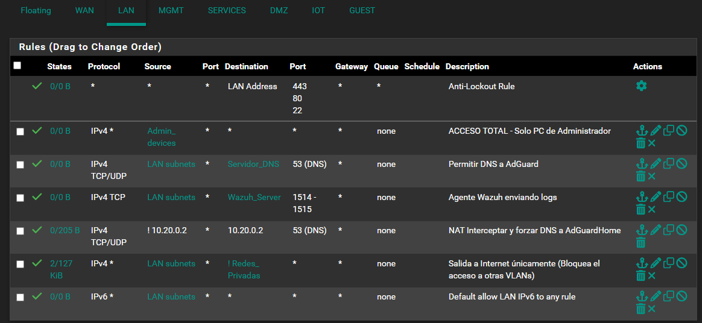
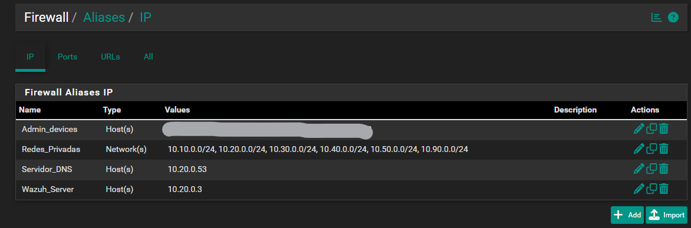
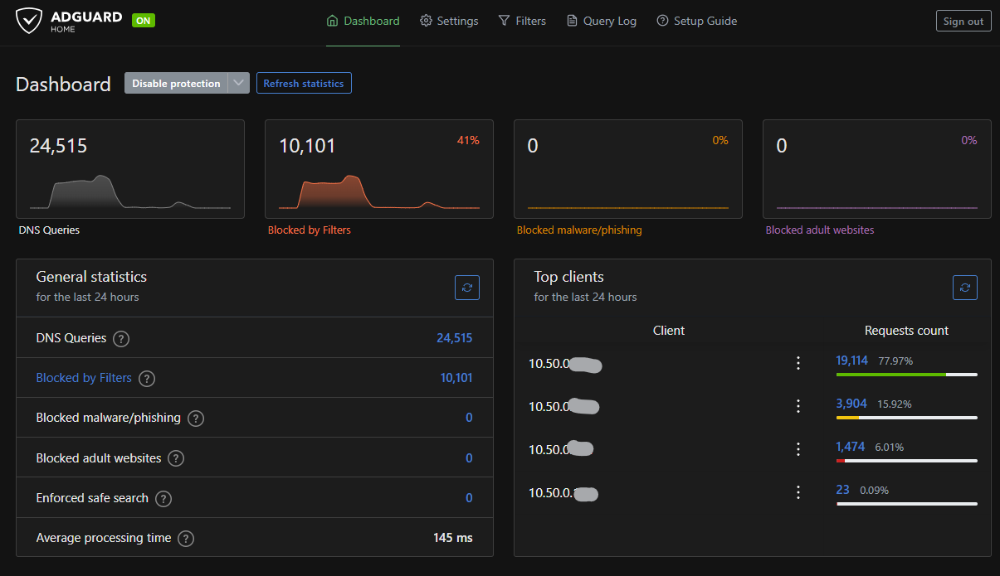
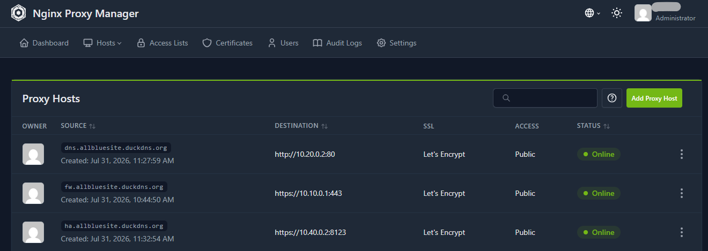

# 🌐 Arquitectura de Red y Perímetro (On-Premise)

Esta sección documenta la capa de red principal del laboratorio local, abarcando la segmentación mediante VLANs, políticas de firewall en pfSense, filtrado DNS y la publicación segura de servicios web.

---

## 1. Segmentación de Red (VLANs)

Para limitar el radio de impacto (*blast radius*) en caso de un compromiso de red, la infraestructura local está dividida estrictamente mediante VLANs gestionadas desde **pfSense**:

| ID VLAN | Nombre | Subred | Propósito / Alcance |
| :--- | :--- | :--- | :--- |
| **VLAN 10** | Management | `10.10.0.0/24` | Interfaces de administración (Proxmox, pfSense GUI, Switches). |
| **VLAN 20** | Services | `10.20.0.0/24` | Servicios internos e Infraestructura de monitoreo (Wazuh SIEM Manager). |
| **VLAN 30** | DMZ | `10.30.0.0/24` | Nginx Reverse Proxy. |
| **VLAN 40** | IoT | `10.40.0.0/24` | Dispositivos inteligentes (Home Assistant) sin acceso a otras VLANs. |
| **VLAN 50** | LAN | `10.50.0.0/24` | Dispositivos de computo de los usuarios dentro de la empresa. |
| **VLAN 90** | Guess | `10.90.0.0/24` | Red para invitados aislada de toda la infraestructura interna. |

---

## 2. Firewall & Políticas de Tráfico (pfSense)

Se aplica una política estricta de Denegación por Defecto (Default Deny) a nivel perimetral e inter-VLAN.

  * Hardening de Interfaz WAN: Se eliminó la exposición del puerto 443/TCP en la WAN para evitar vectores de ataque externos sobre la GUI del firewall.

  * Mecanismo de Administración: El acceso administrativo a pfSense y Proxmox está restringido a la subred LAN (10.50.0.100) y conexiones remotas vía Tailscale (10.10.0.2).

  * Reglas Inter-VLAN Destacadas:

       * Aislamiento de IoT y Guest: Las subredes VLAN 40 (IoT) y VLAN 90 (GUEST) tienen denegado todo acceso hacia las direcciones privadas RFC1918. Únicamente tienen permitido tráfico de salida hacia Internet y consultas DNS hacia AdGuard.

       * Proxy Inverso: El proxy Nginx (10.30.0.2 en DMZ) únicamente tiene permitido comunicarse con la VLAN 40 para reenviar peticiones HTTPS hacia Home Assistant (10.40.0.2:8123).

       * Ingreso de Telemetría al SIEM: Las subredes autorizadas tienen tráfico permitido exclusivamente hacia el puerto 1514/1515 (TCP) de la VLAN 20 para el envío de logs de los agentes Wazuh hacia 10.20.0.3.

---

## 3. Filtrado DNS (AdGuard Home)

**AdGuard Home** actúa como el primer nivel de defensa en la capa de red:

* **Sinkhole DNS:** Bloqueo de dominios de maliciosos, botnets y rastreadores mediante listas de reputación actualizadas.
* **Redirección Estricta:** pfSense redirige todas las consultas salientes del puerto `53/UDP` hacia AdGuard para evitar que dispositivos individuales salten la protección DNS.

---

## 4. Reverse Proxy & Certificados SSL (Nginx)

* **Proxy Inverso:** Nginx gestiona la entrada de tráfico web hacia los servicios internos de la VLAN 20.
* **Terminación TLS:** Garantiza el cifrado de extremo a extremo en las comunicaciones administrativas internas mediante certificados SSL/TLS.
* **Cierre de Puertos:** Se elimina la necesidad de exponer puertos individuales de aplicaciones a la red local.

---

## 📸 Evidencias y Diagramas

### 1. Segmentación de Red y Reglas de Firewall (pfSense)
*Configuración de VLANs e implementación de Aliases RFC1918 para la denegación por defecto entre subredes:*

### 2. Filtrado DNS Perimetral (AdGuard Home)
*Dashboard operativo procesando consultas DNS e interceptando dominios no deseados:*

### 3. Publicación Segura en DMZ (Nginx Proxy Manager)
*Regla de reenvío proxy desde la DMZ hacia la VLAN 40 (IoT):*

